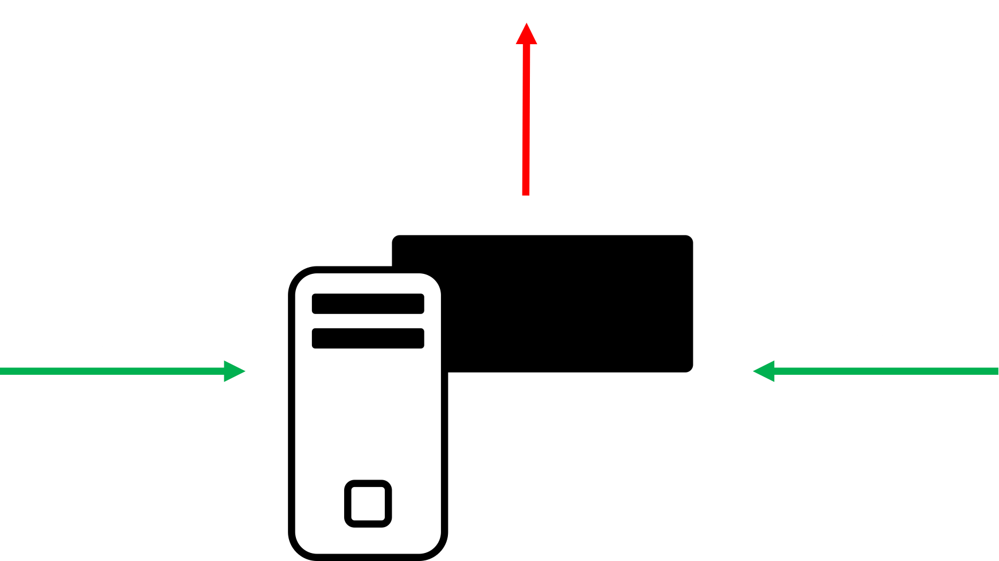
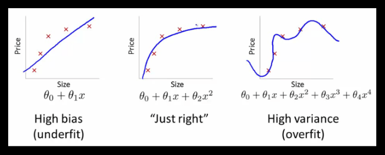

# ML basics
gianluca@ai-academy.com

---

> “Artificial Intelligence, deep learning, machine learning — whatever you’re doing if you don’t understand it — learn it. 

> Because otherwise you’re going to be a dinosaur within 3 years.”

> Mark Cuban

---

## What is Machine Learning?

> "Field of study that gives computers the ability to learn without being explicitly programmed"

1959, Arthur Samuel

---

> "A computer program is said to learn from experience E with respect to some class of tasks T and performance measure P if its performance at tasks in T, as measured by P, improves with experience E."

1996, Tom M.Mitchell

---

# In practice: How do we learn?
Teach me how to walk

---

> “Learning means acquiring knowledge and skills and having them readily available from memory so you can make sense of future problems and opportunities.” 

From Make It Stick: The Science of Successful Learning by Peter C. Brown, Henry L. Roediger III, Mark A. McDaniel

---

The big shift in Machine Learning is in how we tell computers to do stuff.

* Past: Here's a function, when new data comes in, apply the function
* ML: Here's some data (input), and what this data is (output). Learn the function that given the input gives back the output.

---

In figures - "traditional":

---

In figures - ML:

---

In formulas - "traditional":

---

In formulas - ML:

---

What I just described is called
# Supervised Learning

---

Two kinds of supervised learning:
* Regression
* Classification

---

# Regression
* Continuous input, continous output
* Example: stock market predictions, production forecast.

---

# Classification
* Continous input, discrete output
* Example: spam classification, cancer recognition, handwriting recognition, face recognition

---

## Example: we want to predict the price of a house, given its size

---

## Is it regression or classification?
## It's a regression problem! <!-- .element: class="fragment" -->

---

## Some definitions:
* The value I want to predict (price) is called **label**
* The values I use as input (size) are called **features**
* Each sample is called **datapoint**

---

## In this case:
* **Features**: house size
* **Labels**: house price

---

## Example: fitting function

---

## How do we evaluate our model?
## The "Cost function"

---

## Can you tell which one of those models has the lowest cost (which is the best model)?
(and...is it the best model?)

---

## Can you tell which one of those models has the lowest cost (which is the best model)?
(and...is it the best model?)

---

## What if new data comes in?

---

## The problem you just saw is called "overfitting".

---

## Solution: we split the data into a training set and a test set.
The algorithm is evalued based on its performances on data it has never seen, AKA its **generalization ability**.

---

## What if the house price doesn't depend just from its size?
For istance:
* Number of rooms
* Neighborhood
* Year of construction
* Orientation
* Garden y/n?
* Pool

---

## The solution is called "Multi variate regression". 

It's the same exact concept, but in a N-dimensional space. Often the challenge is finding out what are the relevant features that affect a phenomenon (and collect them).

---

## Bonus question: how do I represent with a function the parameter "Neighborhood"?

---

## Other example of Multi variate regression:
I want to predict the height of a person. What features do I need?

---

## Your turn!
I'm a beer producer. I want to predict how much beer to produce next mont. What kind of problem is this?
## It's a regression problem! <!-- .element: class="fragment" -->

---

## What are the labels?
Amount of beer to produce <!-- .element: class="fragment" -->

---

## What are the features?
Up to you, some ideas:

* Weather
* Day of week
* Season
* football match?
* holidays?

---

## New example: 
Predicting if a tumor is malignant or bening based on size and patient's age

---

## Is it regression or classification?
## It's a classification problem! <!-- .element: class="fragment" -->

---

## In this case:
* **Features**: tumor size, patient's age
* **Labels**: Malignant/Bening

---

## What the algorithms will find is called a "decision boundary":

---

## Notice! the algorithm misclassified two datapoints!

---

## This decision boundary instead has 100% accuracy. Does it look right?

---

## This is another example of overfitting

---

## In classification problems, the challenge is choosing a tradeoff between the generalization capabilities of the algorithm, and its precision ("precision" and "recall").

---

## As well as finding the right algorithm for our data

---

## Your turn now!
We want to predict if a monetary transaction is a fraud. What kind of problem is this?

It's a classification problem! <!-- .element: class="fragment" -->

---

## What are the labels? 

fraud / legit <!-- .element: class="fragment" -->

---

## What are the features?

---

Up to you. Some ideas:
* Transaction IP
* Kind of good already bought by user?
* Cost
* Currency
* Time
* Location
* N of Countries card used from (24h)
* Device where the transaction comes from

---

## For more info, check out the [Stripe Radar whitepaper](https://stripe.com/radar/guide)

---

## Your turn again!
We want to understand if a certain user will like a song. What kind of problem is this?

It's a classification problem! <!-- .element: class="fragment" -->

---

## What are the labels?
like / not_like  <!-- .element: class="fragment" -->

---

What are the features?

---

## Up to you. Some ideas:
* tempo
* words
* tone
* singer m/f
* instruments

---

## This last problem I described is called "Content-based recommendation":

## There's another way that can work better, called "community based recommendation"

---

It's mostly done with a technique called *"Matrix Factorization"* (or *SVD, Singular Value Decomposition*). 
## Intuition:
* Gianluca likes songs A, B and C.
* Nicolò likes songs A, B and D.
* I'll recommend to Gianluca song D, and to Nicolò song C.

---

## Which companies are using recommender systems?
Netflix, Amazon, Google, Facebook, Twitter, Instagram, we hope every e-commerce.

---

## What if we have no labels?
This is called **Unsupervised Learning**

---

## What can you say about this dataset?

---

## Looks like there are three separate groups, no?

---

## The algorithm that did this is called K-Means:
Here's a [supercool visualization](https://www.naftaliharris.com/blog/visualizing-k-means-clustering/) of how it works

---

There are other algorithms that will draw different decision boundaries:
[clustering algorithms](../images/clustering_algorithms.png)

---

## Example: We have 15000 energy users, we want to target them with offers based on their behaviour.

---

## What kind of problem is this?
It's an unsupervised learning (clustering) problem! <!-- .element: class="fragment" -->

---

## What are the labels?
There are no labels! It's unsupervised.  <!-- .element: class="fragment" -->

---

## What are the features?
Hourly load  <!-- .element: class="fragment" -->

---

### Opower got sold for $532M in 2016 going from this...
 <!-- .element: style="height : 50vh" --> 

---

### To this, targeted customers with the right offers achieving peak reduction and energy savings
 <!-- .element: style="height : 50vh" --> 

---

# A general machine learning framework

---

## 1. Start from a dataset and a question
* Can I define a question?
* Do I have enough/right features to answer it?
* Do I have enough data?

---

## 2. Explore the data, clean it and understand the relevant features
* Remove outliers
* Start guessing (think like a human)
* Represent features (do you need text vectorization? Discretization? Scaling?)
* Select features (KBest, Percentile, PCA, etc.)

---

## 3. Find an algorithm!
* Is it a supervised or unsupervised problem?
	- If supervised, is the output discrete or continous?
* Start testing basic algorithms
* Fine tune

---

## 4. Evaluate 
* Train/test split
* Pick relevant metrics

