# ML basics
gianluca@ai-academy.com

---

> “Artificial Intelligence, deep learning, machine learning — qualsiasi cosa tu stia facendo, se non lo capisci - imparalo. 

> Perché altrimenti diventerai un dinosauro entro 3 anni.”

> Mark Cuban

---

## Cos'è il Machine Learning?

> "La scienza che da ai computer l'abilità di imparare senza essere programmati esplicitamente"

1959, Arthur Samuel

---

> "Si dice che un computer impara da un'esperienza E rispetto a una cefrta classe di compiti T e misura di performance P se le sue performance nel performare il compito T, come misurato da P, migliora con l'esperienza E."

1996, Tom M.Mitchell

---

# In pratica: Come impariamo?
Insegnatemi a camminare

---

> “Imparare significa acquisire conoscenze ed abilità e averle pronte e disponibili alla memoria così da poter comprendere futuri problemi e opportinutà.” 

Da Make It Stick: The Science of Successful Learning by Peter C. Brown, Henry L. Roediger III, Mark A. McDaniel

---

Il grande cambiamento col Machine Learning è in come diciamo ai computer di fare cose.

* Passato: Eccoti una funzione, quando arrivano nuovi dati, applicala.
* ML: Eccoti dei dati (input), e cosa rappresentano (ouput). Trova la funzione che dato questo input, restituisce l'output.

---

In figure - "tradizionale":

---

In figure - ML:

---

In formule - "tradizionale":

---

In formule - ML:

---

Quello che ho appena descritto si chiama
# Supervised Learning

---

Esistono due tipi di supervised learning:
* Regressione
* Classificazione

---

# Regressione
* Input continuo, output continuo
* Esempio: predizioni sullo stock market, previsioni sulla produzione.

---

# Classificazione
* Input continuo, output discreto
* Esempio: spam classification, riconoscimento tumori, riconoscimento scrittura a mano, riconoscimento volti

---

## Esempio: vogliamo prevedere il prezzo di una casa, data la sua dimensione
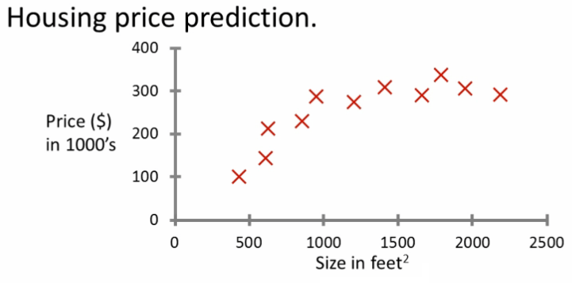

---

## È un problema di regressione o classificazione?
## È un problema di regressione! <!-- .element: class="fragment" -->

---

## Alcune definizioni:
* Il valore che voglio prevedere (prezzo) si chiama **label**
* I valori che uso come input (dimensioni) si chiamano **features**
* Ogni sample si chiama **datapoint**

---

## In questo caso:
* **Features**: dimensioni casa
* **Labels**: prezzo casa

---

## Esempio: funzione di fitting

---

## Come valutiamo il nostro modello?
## La "funzione di costo"

---

## Riesci a dire quale di questi modelli ha il costo migliore?
(e...è questo il miglior modello?)
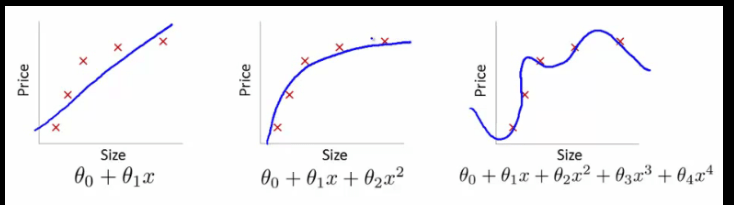

---

## Riesci a dire quale di questi modelli ha il costo migliore?
(e...è questo il miglior modello?)
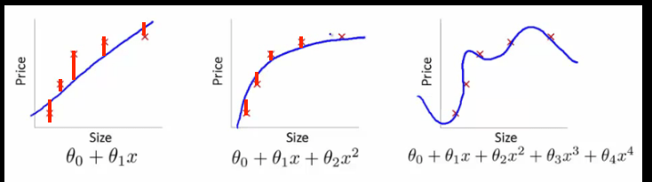

---

## Che succede se arrivano nuovi dati?

---

## Il problema che hai appena visto si chiama "overfitting".

---

## Soluzione: dividiamo i nostri dati in un "training set" e un "test set".
L'algoritmo viene valutato in base alle sue performance su dati che non ha mai visto, AKA la sua **abilità di generalizzare**.

---

## E se il prezzo della casa non dipende solamente dalle sue dimensioni?
Per esempio:
* Numbero di stanze
* Quartiere
* Garage y/n?
* Anno di costruzione
* Orientamento
* Giardino y/n?
* Piscina

---

## La soluzione si chiama "Multi variate regression". 

È esattamente lo stesso concetto, ma in uno spazio N-dimensionale. Spesso la vera sfida è trovare quali sono le feature rilevanti che influenzano il fenomeno (e raccogliere).

---

## Domanda Bonus: come faccio a rappresentare con una funzione il parametro "quartiere"?

---

## Altro esempio di Multi variate regression:
Voglio predire l'altezza di una persona. Di che feature ho bisogno?

---

## Il tuo turno!
Sono un produttore di birra. Voglio predire quanta birra produrre il prossimo mese. Che tipo di problema è?
## È un problema di regressione! <!-- .element: class="fragment" -->

---

## Quali sono le label?
Quantità di birra da produrre <!-- .element: class="fragment" -->

---

## Quali sono le feature?
Dipende da te, alcune idee:

* Meteo
* Giorno della settimana
* Stagione
* C'è una partita di calcio?
* Ci sono feste?

---

## Nuovo esempio: 
Voglio predire se un tumore è maligno o benigno in base alle sue dimensioni e all'età del paziente.

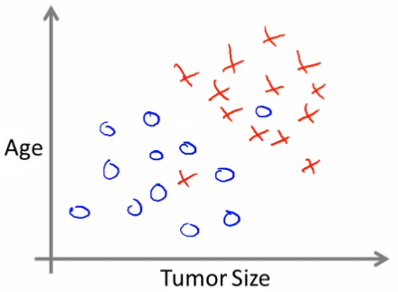

---

## È un problema di regressione o classificazione?
## È un problema di classificazione! <!-- .element: class="fragment" -->

---

## In questo caso:
* **Features**: dimensioni del tumore, età del paziente
* **Labels**: Maligno/benigno

---

## Quello che l'algoritmo troverà si chiama "decision boundary":
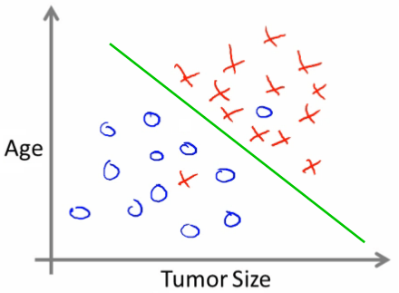

---

## NB! l'algoritmo ha sbagliato a classificarethe due datapoints!
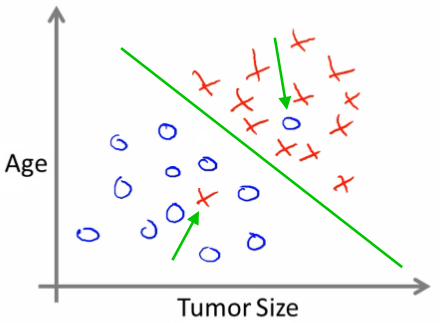

---

## Questo decision boundary invece ha precisione del 100%. Vi sembra sia fatto bene?
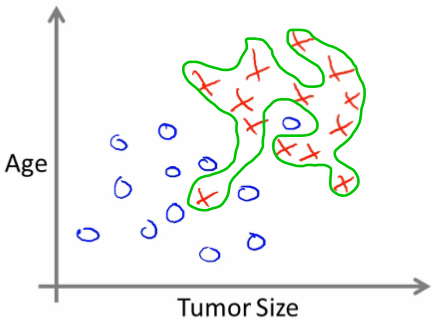

---

## Questo è un altro esempio di overfitting
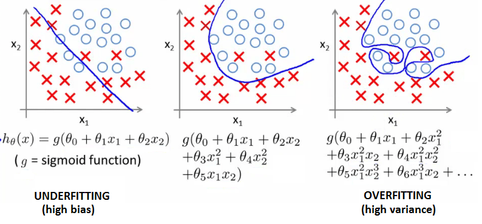

---

## In problemi di classificazione, la sfida spesso è trovare un compromesso tra la capacità dell'algoritmo di generalizzare e la sua precisione ("precision" and "recall").

---

## Oltre a trovare il giusto algoritmo per i nostri dati
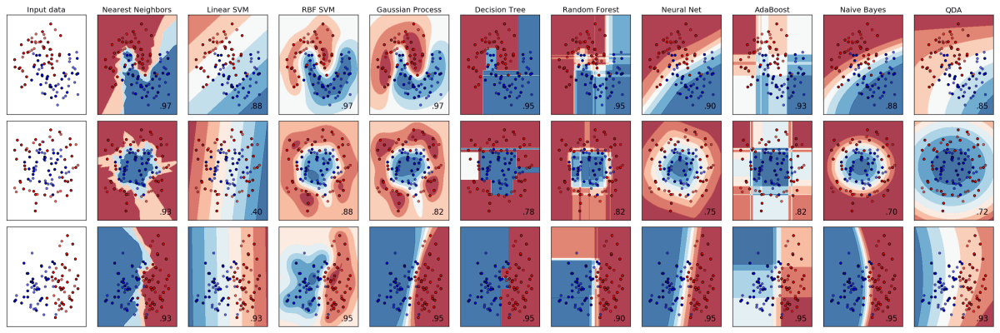

---

## È il tuo turno!
Vogliamo predire se una transazione monetaria è legittima. Che tipo di problema è?

È un problema di classificazione! <!-- .element: class="fragment" -->

---

## Quali sono le labels? 

frode / legittima <!-- .element: class="fragment" -->

---

## Quali sono le features?

---

Dipende da te. Qualche idea:
* IP della transazione
* Il tipo di bene è già stato comprato dall'utente?
* Costo
* Valuta
* Orario
* Location
* N di paesi dalla quale la carta è stata usata (24h)
* Apparecchio dalla quale viene la transazione

---

## Per maggiori info, dai un'occhiata allo [Stripe Radar whitepaper](https://stripe.com/radar/guide)

---

## Il tuo turno di nuovo!
Vogliamo capire se a un utente piace una certa canzone. Che tipo di problema è?

È un problema di classificazione! <!-- .element: class="fragment" -->

---

## Quali sono le labels?
like / not_like  <!-- .element: class="fragment" -->

---

Quali sono le features?

---

## Dipende da te. Alcune idee:
* tempo
* parole
* tonalità
* cantante m/f
* strumenti

---

## Questo problema che ho appena descritto si chiama "Content-based recommendation":

## C'è un altro sistema che potrebbe funzionare meglio, chiamato "community based recommendation"

---

È nella maggior parte dei casi eseguito con una tecnica chiamata *"Matrix Factorization"* (o *SVD, Singular Value Decomposition*). 
## Intuizione:
* A Gianluca piacciono le canzoni A, B e C.
* A Nicolò piacciono le canzoni A, B e D.
* Consiglierà a Gianluca la canzone D, e a Nicolò la canzone C.

---

## Quali aziende usano recommender systems?
Netflix, Amazon, Google, Facebook, Twitter, Instagram, e speriamo qualsiasi e-commerce.

---

## E se non avessimo nessuna label?
Si chiama **Unsupervised Learning**

---

## Cosa potresti dire su questo dataset?

---

## Sembra ci siano tre gruppi distinti, no?
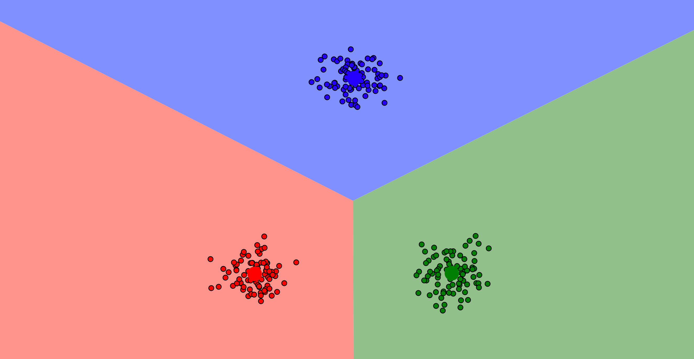

---

## L'algoritmo che ha fatto questa divisione si chiama K-Means:
Ecco una [visualizzazione fighissima](https://www.naftaliharris.com/blog/visualizing-k-means-clustering/) di come funziona

---

Ci sono altri algoritmi che traccerebbero diveri decision boundaries:
[clustering algorithms](../images/clustering_algorithms.png)

---

## Esempio: abbiamo 15000 utenti energetici, vogliamo dividerli in gruppi in base al loro modo di consumare.

---

## Che tipo di problema è?
È un problema di unsupervised learning (clustering)! <!-- .element: class="fragment" -->

---

## Quali sono le labels?
Non ci sono labels! È unsupervised.  <!-- .element: class="fragment" -->

---

## Quali sono le features?
Carico orario  <!-- .element: class="fragment" -->

---

### Opower è stata venduta per $532M nel 2016 trasformando questo...
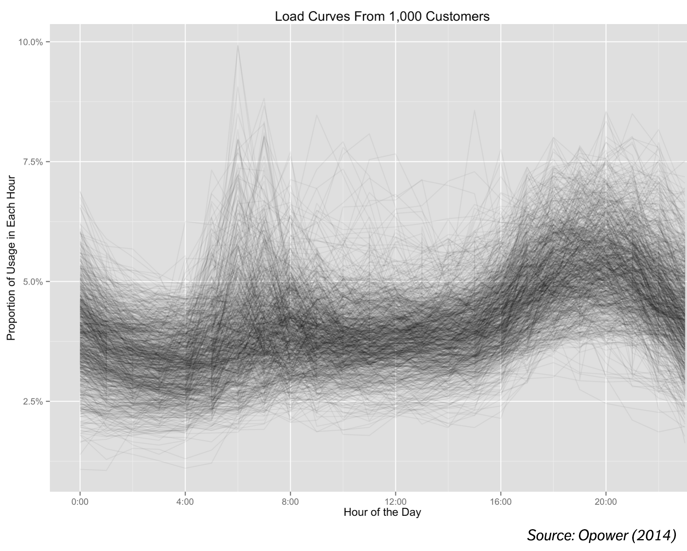 <!-- .element: style="height : 50vh" --> 

---

### In questo, targhetizzando poi i clienti con l'offerta giusta e permettendo riduzione dei picchi e risparmio energetico
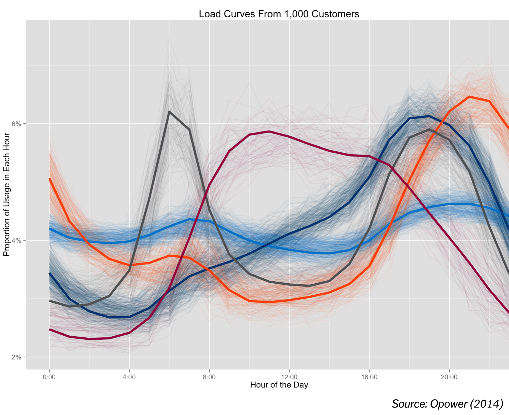 <!-- .element: style="height : 50vh" --> 

---

# Un framework di Machine Learning generalizzato

---

## 1. Inizia da un dataset e da una domanda
* Posso definire una domanda?
* Le mie feature sono abbastanza/adatte per rispondere alla domanda?
* Ho abbastanza dati?

---

## 2. Esplora i dati, puliscili, e capisci quali sono le feature rilevanti
* Rimuovi outliers
* Inizia a fare ipotesi (pensa come un essere umano)
* Rappresenta le features (hai bisogno di text vectorization? Discretizzazione? Scaling?)
* Scegli le features (KBest, Percentile, PCA, etc.)

---

## 3. Trova un algoritmo!
* È supervised o unsupervised problem?
	- Se supervised, l'output è discreto o continuo?
* Inizia a testare algoritmi di base
* Fine tune

---

## 4. Valuta
* Train/test split
* Scegli metriche rilevanti

