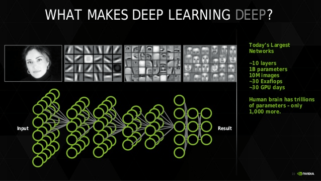

# ML Meetup
## AI for business: Capire l'opportunità
##### gianluca@ai-academy.com

---

<!-- .element: class="box circled-img" -->
  

## Simone, Gianluca e Nicolò
Entrepreneur and Statistiscian, Engineer, Self-driving car Engineer

---

<!-- .element: class="box" -->
  
## About me: 
Engineering -> Entrepreneurship -> Data Science
##### gianluca@ai-academy.com

---

# "L'hype da AI"


---

# "L'hype da AI"


---

# "L'hype da AI"


---

# Perché AI? 
# Perché ora?

---

## Un po' di storia: Dartmouth, 1956


---

# What is intelligence?

> “The true sign of intelligence is not knowledge but imagination” <!-- .element class="fragment" -->

> Albert Einstein <!-- .element class="fragment" -->

---

## AI: generale vs ristretta


---

## Prima applicazione di AI ristretta: 
### English-Russian translator


---

# Risultati:
*  English: 
* "The spirit is strong, but the flesh is weak"
* After English - Russian > Russian - English: <!-- .element class="fragment" -->
* "The whiskey is strong, but the meat is rotten" <!-- .element class="fragment" style="color:red" -->


---

<!-- .slide: data-background="../images/jonsnow.jpg" -->
## Primo "AI Winter" (1966 ~ 1980s):
* ### No potenza di calcolo.
* ### No dati.
* ### No metodi.

---

<!-- .slide: data-background="../images/expertsystem_guys.jpg" -->
## Secondo "AI spring":
### I sistemi esperti

---

# Problemi Expert Systems:
* ### Costosi da realizzare
* ### **Molto** settorializzati
* ### Scarsa capacità di generalizzazione

---

## Un "nuovo" approccio: il Machine Learning


---

# What is Machine Learning?
> «A computer program is said to learn from experience E with respect to some class of tasks T and performance measure P if its performance at tasks in T, as measured by P, improves with experience E»

---

# Funziona?
> "If one could devise a successful chess machine, one would seem to have penetrated to the core of human intellectual endeavor"

> Allen Newell, 1958

---

# Deep Blue vs Garry Kasparov, 1997
<!-- .slide: data-background="../images/deepblue.jpg" -->

---

## Deep Learning: un nuovo (ultimo?) "AI spring"


---

## Deep Learning: un nuovo (ultimo?) "AI spring"


---

<!-- .slide: data-background="../images/andrewng_cats.jpg" -->
## Deep Learning: un nuovo (ultimo?) "AI spring" <!-- .element: style="color:black" -->

---

## Deep Learning: un nuovo (ultimo?) "AI spring"
> "It may be a hundred years before a computer beats humans at ’Go’, maybe even longer"
> - The New York Times, 1997

---

# Alpha go vs Lee Sedol, 2016
> "Master of Go Board Game Is Walloped by Google Computer Program." 
> - The New York Times, 2016 

---

## Deep Learning & Reasoning
### Level = Superhuman


---

## Deep Learning & Computer vision
### Level = Superhuman


---

## Deep Learning & Voice Recognition
### Level = Same as human


---

## Deep Learning & Speech Synthesis
### Level = Close to human


---

# Perchè ora?


---

# Algoritmi
* Rumelhart et Al., Learning representations by back-propagating errors. 1986
* Corinna Cortes and Vladimir Vapnik. Support-vector networks. 1995
* 50+ nuovi paper al giorno su arxiv.

---

# Strumenti open source
* Scikit
* Tensorflow
* Caffe
* Keras
* Theano

---

<!-- .element style="font-size:25px" -->
## Strumenti in pratica: dante-bot

```
def build_graph(batch_size, seq_len, vocab_size, rnn_size):
		x = tf.placeholder(tf.int32,[batch_size, seq_len])
		y = tf.placeholder(tf.int32,[batch_size, seq_len])
		cell = rnn_cell.GRUCell(rnn_size)
		init = cell.zero_state(batch_size, tf.float32)
		embeddings = tf.get_variable('embedding_matrix',[vocab_size, rnn_size])

		rnn_inputs = tf.nn.embedding_lookup(embeddings, x)
		rnn_outputs, final_state = tf.nn.dynamic_rnn(cell, rnn_inputs, initial_state = init)

		with tf.variable_scope('softmax') as scope:
			W = tf.get_variable('W',[rnn_size, vocab_size])
			b = tf.get_variable('b',[vocab_size], initializer=tf.constant_initializer(0.0))

		rnn_outputs = tf.reshape(rnn_outputs, [-1, rnn_size])
		y_ = tf.reshape(y, [-1])
		logits = tf.matmul(rnn_outputs, W) + b

		predictions = tf.nn.softmax(logits)
		cross_entropy = tf.nn.sparse_softmax_cross_entropy_with_logits(logits, y_)
		loss = tf.reduce_mean(cross_entropy)
		
		train_step = tf.train.AdamOptimizer(learning_rate).minimize(loss)
```

---

## Dati disponibili


---

## Prezzo storage dati


---

## Potenza computazionale disponibile


<!-- ---

## Performance GPUs
 -->

---

## Prezzo CPU


---

<!-- .slide: data-background="../images/hotz_dark.jpg" -->
> "Many of the papers, data sets, and software tools related to deep learning have been open sourced. [...] Software tools like Theano and TensorFlow, combined with cloud data centers for training, and inexpensive GPUs for deployment, allow small teams of engineers to build state-of-the-art AI systems." 
> Chris Dixon, A16Z partner

 <!-- .element: style="background:rgba(0,0,0,0.4)" -->

---

# Come rispondono gli investitori?

---

<!-- .slide: data-background="#ffffff" -->


---

# Come rispondono le corporate?

---

<!-- .slide: data-background="../images/AI_exits.png" -->

---

* Social: Pinterest deep-learning-powered reccommender: +30% repins
* Ecommerce: The Clymb ha avuto +175% revenue/1000 promo email, -72% churn (HBR)
* Customer service: 85% interazioni senza interazione umana nel 2020 (Gartner).

---

* Marketing & sales: 76% delle aziende che usano ML hanno aumentato le proprie revenue (Accenture)
* Fintech: Banche che usano ML per promuovere prodotti ottengono +10% sales e -20% churn (Accenture).
* Ingegneria: Sight ha ridotto downtime macchine 50% e aumentato performance del 25%
* ...

---

# Conclusioni
> "AI is the new electricity. Just as 100 years ago electricity transformed industry after industry, AI will now do the same." 
> * Andrew Ng, Chief Scientist at Baidu

---

## È il momento di passare da "ML as a product" a "ML as a feature".

---

# Q&A

