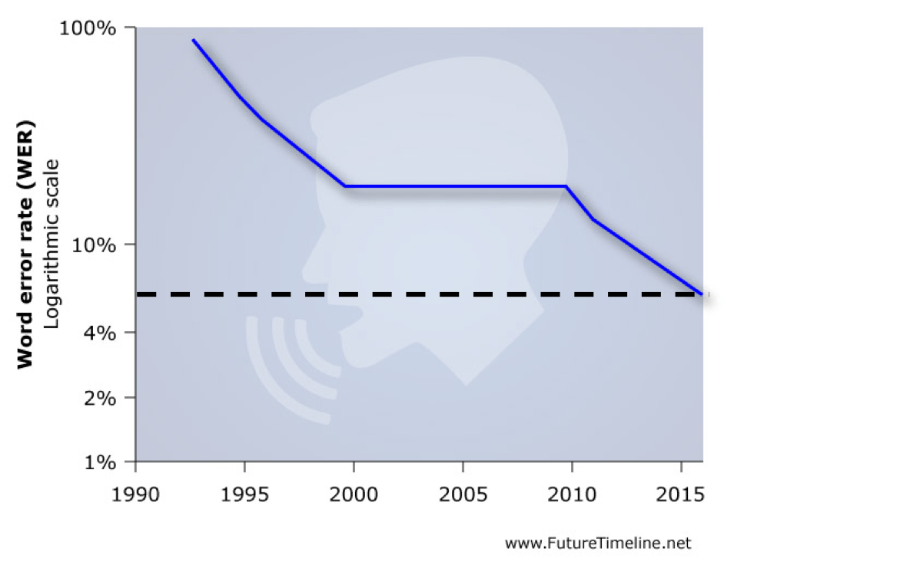
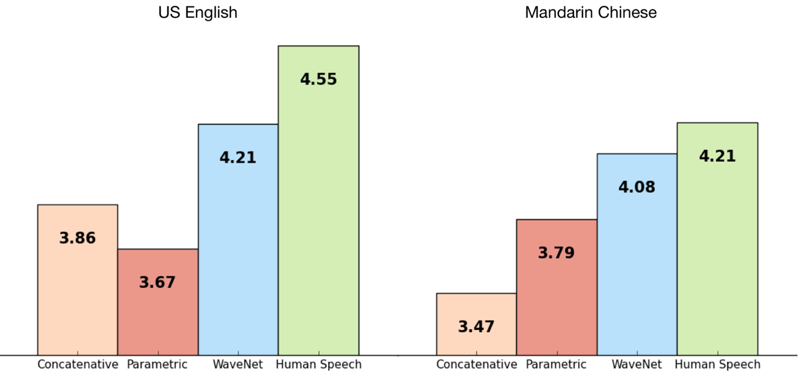

# AI success cases, technology trends and challenges

---

# Bad news first...

---

<!-- .slide: data-background="../images/social_media_bias.jpg" -->

## Problemi da risolvere: AI Bias <!-- .element style="color: black" -->
** "Polarization as a driver for populism"** <!-- .element style="color: black" -->

---

## Problemi da risolvere: AI Bias (di nuovo...)
# HR:
"You're only as good as your data"

---

## Problemi da risolvere: *AI Bias (di nuovo...)*

Criminale 1:
	* 2 rapine a mano armata
	* 1 tentata rapina a mano armata

Criminale 2:
	* 4 casi di miscondotta giovanile

Domanda: chi è più a rischio di compiere nuovi reati?

---

## e invece...

---

<!-- .slide: data-background="../images/data_concentration.jpg" -->
## Problemi da risolvere: data concentration <!-- .element style="color: black" -->

---

## Opportunità, sfide e stato dell'arte

---

## Sfide: comprendere il deep learning
L'AI è buona o cattiva?

---

## Sfide: comprendere il deep learning
Sappiamo veramente cosa l'AI sta facendo?

---

## General AI: alcuni pensieri.
Cosa eravamo abituati a pensare:

---

## General AI: alcuni pensieri.
E se invece...

---

## The intelligence explosion

---

# Let's get more real...

---

## AI Performances

> **AI has by now succeeded in doing essentially everything that requires ‘thinking’ but has failed to do most of what people and animals do ‘without thinking'“**
	> Donald Knuth, 2009

---

### Reasoning: GO 
### Level: SuperHuman
> **“The way AlphaGo plays Go is not like any human being plays Go. It made moves that were completely unexpected, that seemed terrible but were great instead”**

> **“I already improved: AlphaGo gave me new ideas”** 
	
	> Lee Sedol

---

### Knowledge Representation
### Level: SuperHuman (sometimes)

---

### Knowledge Representation
### Level: SuperHuman (sometimes)

---

### Planning and Navigation Level: Close to Human
* 2004:DARPAsponsoredtheveryfirstdriverlesscarGrand Challenge. the winning entry went 7.2 miles out of 150
* 2007:DARPAsponsorstheUrbanChallenge,thewinning entries went 60 miles under city-like constraints.
* 2015: One person, in a literal garage, building a self-driving car.

---

### Performances: speech recognition 
### Level = Same as human

---

### Performances: speech synthesis 
### Level = Close to human

---

### Performances: computer vision
### Level = Superhuman

---

### Opportunities: **"now we can see"**

---

<!-- .slide: data-background="../images/amazon.png" -->

---

## Closing thougts
> “First it was mobile, then it was the cloud.
Now it’s AI ‘s turn, and we believe it’s going to be bigger than both”
	
	> Marc Andreessen 

---

# It’s your turn.

---

# Q&A

---

# One more thing:

