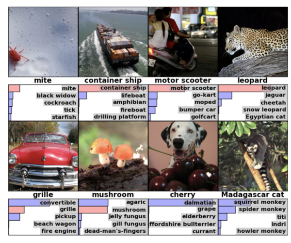

# Deep learning
nico@ai-academy.com

---

## Deep Learning

La tecnologia dietro:
  
- self driving cars
- riconoscimento vocale
- riconoscimento facciale

---

## Deep Learning vs Machine Learning

---

## Che features scegliereste per distinguere cani da gatti?

---

---

## Quali applicazioni?

---

Object classification

---

Il Deep Learning ha permesso di migliorare notevolmente le performance in questo test di classificazione.

---

Object detection

---

Automatic captioning

---

## Come funziona?

---

Una sequenza di trasformazioni estrae *feature* via via piu' significative dal dato di partenza.

---

L'asso nella manica del Deep Learning e' che lo stesso codice funziona con formati di dati molto diversi (i.e. immagini/voce).

---

Nel caso di immagini, le reti **convoluzionali** sono particolarmente efficaci.

---

## Deep Learning vs Machine Learning

- ☺ magia!
- ☺ permette di trattare problemi fin'ora inaccessibili
  
- ☹ richiede grandi quantita' di dati
- ☹ richiede molta potenza di calcolo
- ☹ e' difficile spiegare a posteriori gli output del modello

---

---

## Demo

More to come..

---

# Machine Learning   passo-passo

---

1. Parti dall'obiettivo

2. Raccogli e osserva i dati

3. Scegli un algoritmo

4. Valuta i risultati

---

## 1. Obiettivo

* Qual'è la domanda alla quale rispondere?

---

## 2. Dati

---

### 3. Algoritmo

---

### 4. Valutazione

---

## 1. Inizia da un dataset e da una domanda
* Posso definire una domanda?
* Le mie feature sono abbastanza/adatte per rispondere alla domanda?
* Ho abbastanza dati?

---

## 2. Esplora i dati, puliscili, e capisci quali sono le feature rilevanti
* Rimuovi outliers
* Inizia a fare ipotesi (pensa come un essere umano)
* Rappresenta le features (hai bisogno di text vectorization? Discretizzazione? Scaling?)
* Scegli le features (KBest, Percentile, PCA, etc.)

---

## 3. Trova un algoritmo!
* È supervised o unsupervised problem?
	- Se supervised, l'output è discreto o continuo?
* Inizia a testare algoritmi di base
* Fine tune

---

## 4. Valuta
* Train/test split
* Scegli metriche rilevanti

