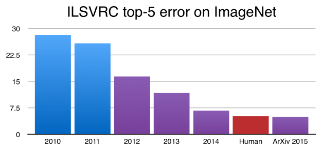

# Deep learning
nico@ai-academy.com

---

## Deep Learning

La tecnologia dietro:
  
- self driving cars
- riconoscimento vocale
- riconoscimento facciale

---

## Deep Learning vs Machine Learning

---

## Che features scegliereste per distinguere cani da gatti?

---

---

## Quali applicazioni?

---

Object classification

---

Il Deep Learning ha permesso di migliorare notevolmente le performance in questo test di classificazione.

---

Object detection

---

Automatic captioning

---

## Come funziona?

---

Una sequenza di trasformazioni estrae *feature* via via piu' significative dal dato di partenza.

---

L'asso nella manica del Deep Learning e' che lo stesso codice funziona con formati di dati molto diversi (i.e. immagini/voce).

---

Nel caso di immagini, le reti **convoluzionali** sono particolarmente efficaci.

---

## Deep Learning vs Machine Learning

- ☺ magia!
- ☺ permette di trattare problemi fin'ora inaccessibili
  
- ☹ richiede grandi quantita' di dati
- ☹ richiede molta potenza di calcolo
- ☹ e' difficile spiegare a posteriori gli output del modello

---

---

## Demo

More to come..

---

# Teamwork

---

## Obiettivo

Inventare una AI-based feature per un prodotto

> 1. Qual'è l'obiettivo?
> 2. Come ottenere i dati?
> 3. Di quale tipo di algoritmo ho bisogno?
> 4. Come valutare i risultati?

**Tempi:** 1/2 ora di teamwork + 1/2 ora di discussione

