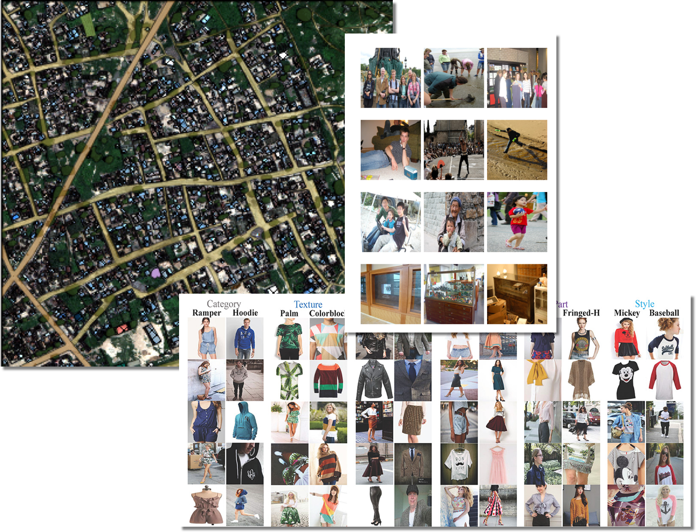

name: break
layout: true
class: center, middle, inverse
---
# AI Implementation Strategy
### nico@ai-academy.com

.footnote[
  Roma 	• 2016.12.17
]
---
name: about
layout: false
class: bottom, left
background-image: url(imgs/curiosity.jpg)
## About me

#### Aerospace Engineer
#### Love robots, drones
---
template: break
# Intro
### Objectives
### Plan
---
class: inverse
.left-column[
 ## Intro
 ### Objectives
]
.right-column[

## Capire:

- cosa e' possibile *oggi*

- quanto costa

- quali persone servono

- strategia di implementazione
]
???
Anche saper giudicare le offerte di aziende e startup.
---
class: inverse
layout: false
.left-column[
 ## Intro
 ### Objectives
 ### Plan
]
.right-column[
## Part 1: Ideas

- *meta*-decisions
- Data
- Tech
- People

## Part 2: Case studies

- Recommending movies
- Choosing restaurants
- Interactive bot

]
???
Per ultimo andremo a parlare di *persone*, non perche' sia un fattore poco importante, anzi, ma perche' volevo che tutti avessero una preparazione di base prima di introdurre i profili necessari per una implementazione di successo.
---
template: break
# Idea 1: Meta
### Build or buy
### Commoditization
???
Queste sono idee che devono restare sempre qua dietro nella vostra testa, e informare ogni decisione che vogliate prendere. Sonotemi che ritroveremo spesso durante la presentazione.
---
class:inverse

.left-column[
## Meta
### Build or buy
]
.right-column[

- Startup

- Grandi giocatori (Google, Amazon, ..)

- Lock-in?

- *Open-source* e' la nostra unica speranza
]
???
---
class:inverse

.left-column[
## Meta
### Build or buy
### Commodity
]
.right-column[
- Le tecnologie *hot* di oggi sono le commodity di domani.

- Do *not* build tech
]
???
Quello che oggi e' un differenziatore importante per il vostro business, domani puo' diventare una soluzione completamente scontata. Da un punto di vista non tecnico, pensate alla presenza sui social network, o ancora piu' indietro, l'e-commerce. Queste sono state tecnologie incredibilmente trasformative, eppure ora sono date per scontate sia dai clienti B2B che da quelli B2C.

Insomma, non costruite tecnologia almeno che non sia parte core del business.
---
template: break

# Idea 2: Data
### Data you have
### Data you can get
### Other people's data
???
Simone prima si e' concentrato molto sul fatto che l'ingrediente principale dell'AI siano i dati. Qui voglio parlare di come ottenerli in un'ottica di implementazione.

Voglio farvi capire come ci sia una specie di gerarchia nella qualita' dei dati. Parleremo dei dati che avete, dei dati che potete ottenere cambiando i processi di business, e dei dati offerti da altre persone.
---
class: inverse

.left-column[
## Data
### Data you have
]
.right-column[

- Dati strutturati estratti dai processi base del business (analytics, foto, sensori, ...)

- Quantita' relativamente limitata

- Importanza strategica

- Non servono strumenti sofisticati [come Spark](http://aadrake.com/command-line-tools-can-be-235x-faster-than-your-hadoop-cluster.html)
]
???
Partiamo dal *low-hanging fruit*, dai dati che fanno gia' parte dei processi di business. In base al tipo di business, questi possono essere click, acquisti, profilazione utenti, ... Per loro natura saranno in quantita' limitata, ma compensano con la centralita' nella gestione del business.

Vista la situazione, e che i dati sono generalmente gia' ben strutturati, non c'e' bisogno di strumenti sofisticati, ma basta un database relazionale.
---
class: inverse

.left-column[
## Data
### Data you have
### Data you can get
]
.right-column[
- Dati ottenibili con (piccole) modifiche ai processi (e.g. chiedere feedback)

- Meno strategici ma aprono nuove opportunita'

- Amazon Mechanical Turk e' crowd-sourcing della corteccia celebrale umana.

.footnote[
[tooling per Mechanical Turk](http://labelme.csail.mit.edu/Release3.0/browserTools/php/mechanical_turk.php)
]
]
</small>
???
Esempio personale: avevamo una tabella per tracciare le conversioni, e ne abbiamo aggiunta un'altra.

Esempio: tutte le immagini che vedete su ImageNet sono state classificate con MT.
---
class: inverse

.left-column[
## Data
### Data you have
### Data you can get
### Other people's data
]
.right-column[
- Milioni di immagini, percorsi, statistiche

- Abbondanti e gratis ma distanti dal proprio business

- Utili per lo sviluppo degli algoritmi, *unsupervised learning*, testing

]
---
template: break

# Idea 3: Tech
### Goals
### Storage
---
class: inverse

.left-column[
## Tech
### Goals
]
.right-column[
- Velocita' di iterazione e sviluppo ⇒ sviluppatori felici

- Riproducibilita' dei risultati (inclusa pulitura, processing, e reporting)

- *Stack* di analisi flessibile e ben supportato (Python, R, ..)
]
???
Qualche considerazione su alcuni punti importanti a cui prestare attenzione, al di fuori delle ovvieta'.

La velocita' di iterazione e' fondamentale per mantenere il processo agile. Visto che gli algoritmi richiedono un tempo intrinseco di computazione, e' fondamentale ridurre al minimo l'impatto dell'infrastruttura per massimizzare la velocita' degli sviluppatori. C'e' una bella differenza tra un ciclo di sviluppo di 10 secondi, di 10 minuti, e di una notte.

Secondo, e' facile cascare nella trappola e creare dei flussi di analisi basati sul massaggiamento manuale dei dati, o del sano copia e incolla. Invece, e' critico imporre sin dall'inizio la riproducibilita' totale dei processi, per permettere di confrontare rapidamente ipotesi e algoritmi.
---
class: inverse

.left-column[
## Tech
### Goals
### Storage
]
.right-column[

- I dati sopravvivono agli algoritmi: stabile e' bello

- Dati strutturati vs. non strutturati: *Excel vs Database*

- La pulitura dei dati e' sempre piu' lunga del previsto

]
---
template: break

# Idea 4: People
### Expertise
### Team
---
class: inverse

.left-column[
## People
### Expertise
]
.right-column[
Di quale di queste persone hai bisogno?

- SW Engineer

- Data scientist

- Researcher
]
---
class: inverse

.left-column[
## People
### Expertise
### Team
]
.right-column[
- supporto ed integrazione col resto del team

- disponibilita' ad accogliere gli insights provenienti dai dati
]
---
template: break
# Q&A
---
template: break
# Cases
### A simple recommender
### Image search
### Chatty chatbot
???
Ora che abbiamo le dimensioni sulle quali pensare, vediamo tre casi "svolti". Vedrete come il livello di complicazione e di ricerca necessario aumentera' dal primo al terzo caso, e come le tecniche, le risorse, e le persone necessarie per lo sviluppo cambino.
---
template: break
# Case 1: simple recommender
### info • research • demo • strategy
---
class: inverse

.left-column[
## Recommender
### Info
]
.right-column[
### Obiettivo
Aiutare gli utenti con un sistema di raccomandazioni (<b>completamente generico!</b>)

### Dati a disposizione
Interazioni degli utenti con la piattaforma, rating
]
---
class: inverse

.left-column[
## Recommender
### Info
### Research
]
.right-column[
### Approccio
Blog e documentazione delle librerie forniscono molte informazioni <small>(incluso il codice sorgente per il premio Netflix da $1mln)</small>

]
---
class: inverse

.left-column[
## Recommender
### Info
### Research
### Demo
]
.right-column[
]
---
class: inverse

.left-column[
## Recommender
### Info
### Research
### Demo
### Strategy
]
.right-column[
### Tech
- Python + *pandas*
- ~ 100.000 elementi
- ~ 10 minuti di calcolo

### Risorse e skills
SW Engineer per ~ 1 settimana

### Bonus points
Basato solamente sulle preferenze degli utenti: funziona su film, locali, musica, amicizie, ...

]
---
class: inverse
exclude: true

.left-column[
## Case 1
### Idea
### Strategy
]
.right-column[
Mezza giornata di ricerca fornisce diverse opzioni per gli algoritmi:

- **collaborative**
  * **item-item**: *ai clienti a cui piace questo prodotto, piace anche...*
  * **user-item**: *ai clienti simili a te piace...*
  * **model-based**: *latent factor analysis*

- **content-based**: *se ti e' piaciuto questo prodotto, forse ti piacera'...*

]
---
template: break
# Case 2: image search
### info • research • demo • strategy
---
name: food
background-image: url(imgs/pinterest.png)
---
class: inverse

.left-column[
## Image search
### Info
]
.right-column[
### Obiettivo
Riconoscere e proporre agli utenti immagini simili.

### Dati a disposizione
~ 100.000 immagini scattate da smartphone, con luoghi, soggetti, ed illuminazione varia.
]
---
class: inverse

.left-column[
## Image search
### Info
### Research
]
.right-column[
### Approccio
Blog posts [1], codice open-source [2], papers [3]

### Deep learning
Grazie alle librerie open-source, e' possibile testare approcci allo stato dell'arte con poco impegno.

.footnote[
  [1] [blog](https://engineering.pinterest.com/blog/introducing-new-way-visually-search-pinterest)

  [2] [codice](https://github.com/AKSHAYUBHAT/VisualSearchServer)

  [3] [arxiv](arxiv.org)
]
]
---
class: inverse

.left-column[
## Image search
### Info
### Research
### Demo
]
.right-column[

]
---
class: inverse

.left-column[
## Image search
### Info
### Research
### Demo
### Strategy
]
.right-column[
### Tech
- Python + TensorFlow
- ~ 50.000 immagini
- ~ 10 ore di calcolo

### Risorse e skills

SW Engineer + Esperto Deep Learning per ~ 2 settimane

### Bonus points

Funziona con immagini di qualunque categoria (cibo, moda, oggettistica, ...)
]
---
template: break
# Case 3: chatty chatbot
### info • research • demo • strategy
---
class: inverse

.left-column[
## Chatbot
### Info
]
.right-column[
### Obiettivo

Costruire un *bot* in grado di dialogare con l'utente in maniera creativa, non pre-programmata.

### Dati a disposizione

~ 200.000 battute cinematografiche, 9000 personaggi (<b>10 MB</b>)
]
???
Notate come una quantita' relativamente enorme di dati e' ridicola per un moderno computer. Questo mostra come raramente nelle applicazioni la capacita' di calcolo sia un collo di bottiglia.
---
class: inverse

.left-column[
## Chatbot
### Info
### Research
]
.right-column[
  ### Modelli classificativi
  Reagiscono scegliendo tra una serie di risposte pre-programmate (*expert-system*)

  ### Modelli generativi
  Utilizzano un modello linguistico che permette di **improvvisare**.

  ### Approccio
  Papers ([1], [2]), modelli open-source [2].

  .footnote[
    [1] [seq2seq](https://www.tensorflow.org/tutorials/seq2seq/)
    [2] [arxiv](https://arxiv.org/abs/1506.05869)
    [3] [DeepQA](https://github.com/Conchylicultor/DeepQA)
  ]
]
???
Tonnellate di ricerca. La piu' stabilita si basa sui modelli classificativi, ma con l'avvento del DL ci si e' focalizzati anche su modelli *generativi*.
---
class: inverse

.left-column[
## Chatbot
### Info
### Research
### Demo
]
.right-column[
]
---
class: inverse

.left-column[
## Chatbot
### Info
### Research
### Demo
### Strategy
]
.right-column[
  # Buy it!
]
---
background-image: url(imgs/bot-class.jpg)
---
template: break
# Cases
### A simple recommender
### Image search
### Chatty chatbot
???
Ora che abbiamo le dimensioni sulle quali pensare, vediamo tre casi "svolti". Vedrete come il livello di complicazione e di ricerca necessario aumentera' dal primo al terzo caso, e come le tecniche, le risorse, e le persone necessarie per lo sviluppo cambino.
---
template: break
# Q&A