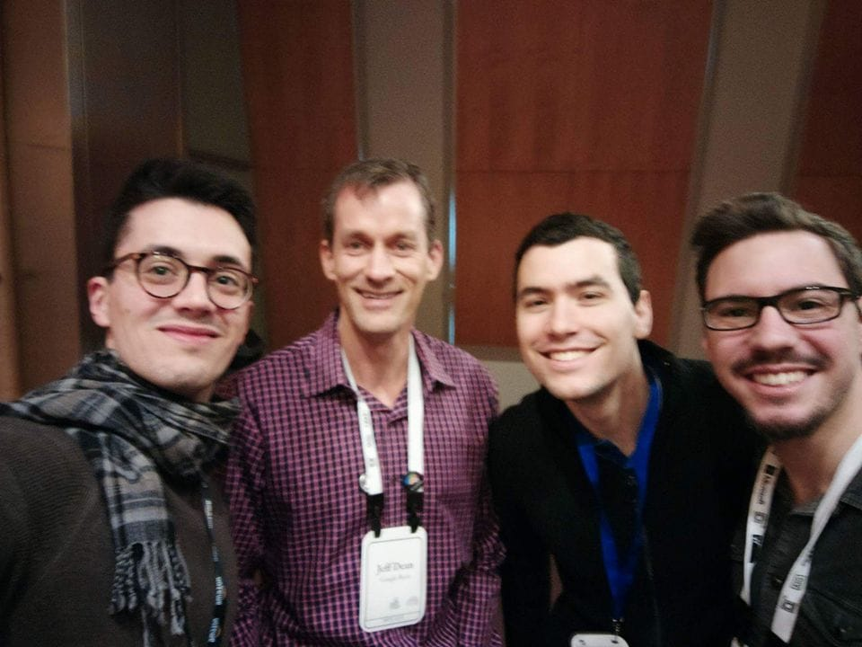
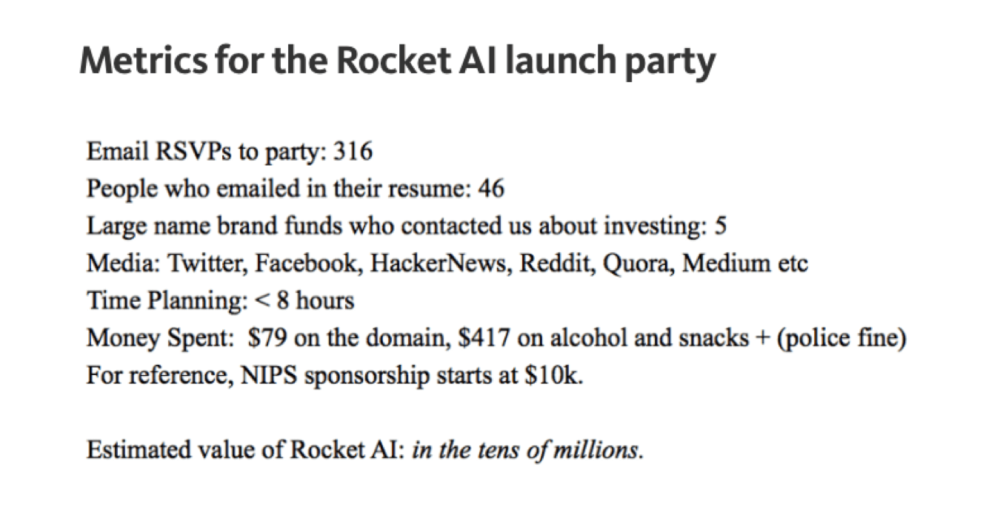
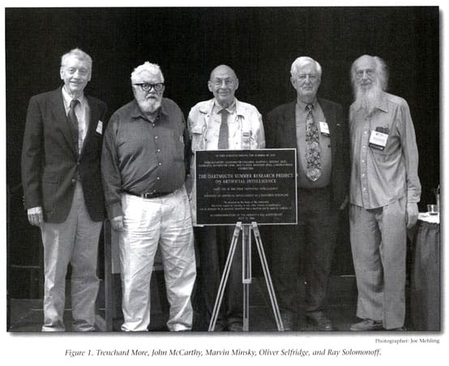
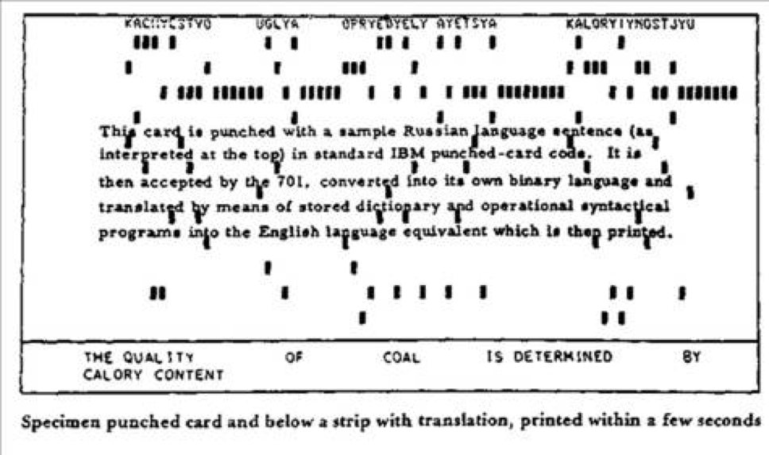
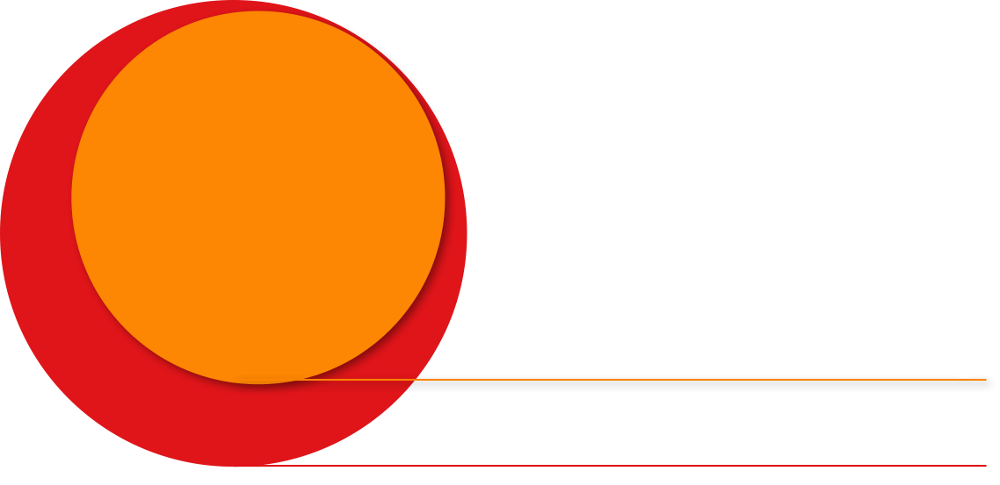
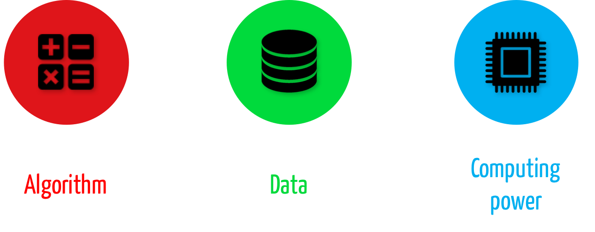
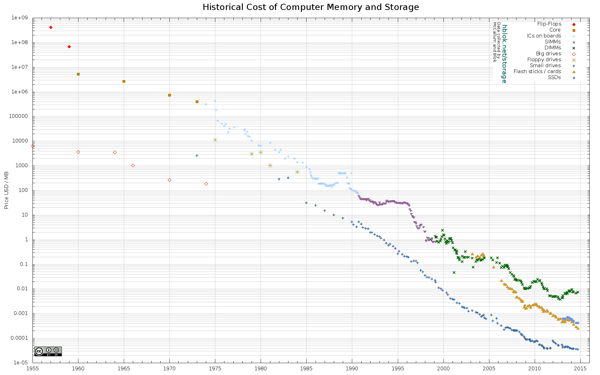
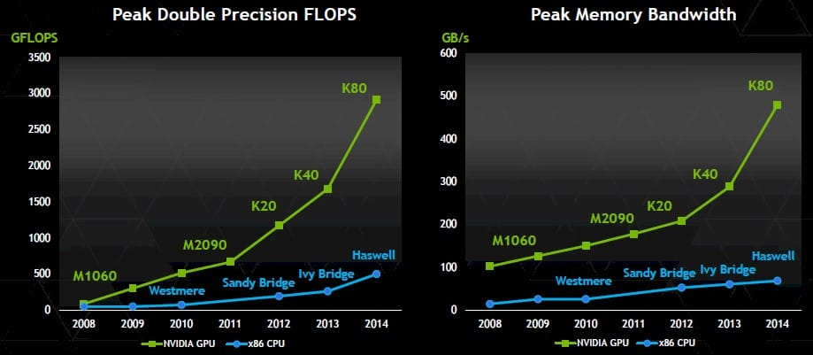
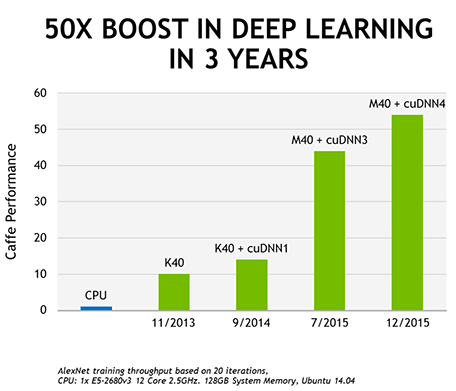

# Intelligenza artificiale per il tuo business

---

## Programma:
1. Perché l’AI: capire l’opportunità
2. Cos’è l’AI: principi di base
3. Sessione pratica: Assisted brainstorming
4. Come fare AI: strategie di implementazione + demo
6. AI success cases, technology trends and challenges

---

<!-- .element: class="box circled-img" -->
  

## Simone, Gianluca e Nicolò
Entrepreneur and Statistiscian, Engineer, Self-driving car Engineer

---

<!-- .element: class="box" -->
  
## About me: 
Engineering -> Entrepreneurship -> Data Science
##### gianluca@ai-academy.com

---

# Perchè l'AI
## gianluca@ai-academy.com

---

# "L'hype da AI"
 <!-- .element style="height: 45vh" -->

---

# "L'hype da AI"

---

# "L'hype da AI"

---

# Domanda:
## Quando bisogna investire in una tecnologia?

---

## Diffusione delle innovazioni:
La funzione logistica

---

## Diffusione delle innovazioni:
La funzione logistica

---

## It really works...

---

## Qual'è il momento giusto per investire?

---

# A che punto siamo con l'AI?
## Diamo un'occhiata alla storia

---

---

---

---

# What is intelligence?
> “The true sign of intelligence is not knowledge but imagination” <!-- .element class="fragment" -->

> Albert Einstein <!-- .element class="fragment" -->

---

## AI: generale vs ristretta

---

## Prima applicazione di AI ristretta: 
### English-Russian translator
 <!-- .element style="height: 45vh" -->

---

---

# Risultati:

*  English: 
* "The spirit is strong, but the flesh is weak"
* After English - Russian > Russian - English: <!-- .element class="fragment" -->
* "The whiskey is strong, but the meat is rotten" <!-- .element class="fragment" style="color:red" -->

---

<!-- .slide: data-background="../images/jonsnow.jpg" -->
## Primo "AI Winter" (1966 ~ 1980s):
* ### No potenza di calcolo.
* ### No dati.
* ### No metodi.

---

<!-- .slide: data-background="../images/expertsystem_guys.jpg" -->
## Secondo "AI spring":
### I sistemi esperti

---

## Problemi dei Sistemi Esperti: Eliza

* I have problems with my mother What kind of problems?
	* I feel neglected...
* OK... "I feel neglected". Tell me more.
	* I feel like she doesn't like me
* Tell me more about such feelings.
	* I feel like she prefers my sister
* Do you often feel like she prefers your sister?
	* Every day
* OK... "I feel like she prefers your sister". Tell me more.

---

## Problemi dei Sistemi Esperti: Eliza

* I ate too much and my stomach hurts Can you tell me more?
	* My stomach hurts
* What does that suggest to you?
	* What does that suggest to you? We were discussing you, not me.
* I want to know your opinion
	* What would it mean to you if you got to know my opinion?
* Much
	* OK... "I want to know my opinion". Tell me more.

---

# Problemi Expert Systems:
* ### Costosi da realizzare
* ### **Molto** settorializzati
* ### Scarsa capacità di generalizzazione

---

## Scetticismo:
> *“The history of research on artificial intelligence to date has always consisted of a very limited number of successes in specific areas, followed immediately by failures in achieving the larger goals that these initial successes seemed initially suggest.”*

	> Jack Schwartz, 1987

---

## Un "nuovo" approccio: il Machine Learning

---

## Cos'è il Machine Learning?
> "La scienza che da ai computer l'abilità di imparare senza essere programmati esplicitamente"

1959, Arthur Samuel

---

## Definizione rigorosa di ML
> "Si dice che un computer impara da un'esperienza E rispetto a una cefrta classe di compiti T e misura di performance P se le sue performance nel performare il compito T, come misurato da P, migliora con l'esperienza E."

1996, Tom M.Mitchell

---

# Human Learning in pratica:
Insegnatemi a camminare

---

## The new (last?) AI spring
> *“If one could devise a successful chess machine, one would seem
to have penetrated to the core of human intellectual endeavor”*
	> Allen Newell, 1958

---

# Deep Blue vs Garry Kasparov, 1997
<!-- .slide: data-background="../images/deepblue.jpg" -->

---

## Deep Learning: un nuovo (ultimo?) "AI spring"
> "It may be a hundred years before a computer beats humans at ’Go’, maybe even longer"
> - The New York Times, 1997

---

# Alpha go vs Lee Sedol, 2016
> "Master of Go Board Game Is Walloped by Google Computer Program." 
> - The New York Times, 2016 

---

# Alpha go vs Lee Sedol
<!-- .slide: data-background="../images/alphago.png" -->

---

## Perchè ora: gli ingredienti dell'AI

---

# Algoritmi
* Rumelhart et Al., Learning representations by back-propagating errors. 1986
* Corinna Cortes and Vladimir Vapnik. Support-vector networks. 1995
* 50+ nuovi paper al giorno su arxiv.

---

# Strumenti open source
* Scikit
* Tensorflow
* Caffe
* Keras
* Theano

---

## Dati disponibili
 <!-- .element style="height: 45vh" -->

---

## Prezzo storage dati

---

## Potenza computazionale disponibile

---

## Performance GPUs

---

## Prezzo CPU

---

## Quindi...a che punto siamo con l'AI?
## Perchè ci interessa?

---

## A che punto siamo con l'AI?

---

## A che punto siamo con l'AI?

---

# Come rispondono gli investitori?

---

---

# Come rispondono le corporate?

---

<!-- .slide: data-background="../images/AI_exits.png" -->

---

# AI acquisitions, then:
* **DNNresearch** is a startup founded by Professor Geoffrey Hinton of The University of Toronto.
* **Hunch** is developing an online decision engine
* **DeepMind** is a cutting edge artificial intelligence company. The company combines the best techniques from machine learning and systems neuroscience to build powerful general-purpose learning algorithms.

---

## AI acquisitions, now:
* Wise.io is a machine-learning powered service that delivers rapid, collaborative prototyping and production deployment of advanced machine learning solutions, and helps businesses find patterns and trends in their vast data stores.
* Bit Stew Systems provides MIx Core, a platform for handling data integration, data analysis, and predictive automation for connected devices on the Industrial Internet of Things (IIoT).

---

<!-- .slide: data-background="../images/hotz_dark.jpg" -->
> " Many of the papers, data sets, and software tools related to deep learning have been open sourced. This has had a democratizing effect, allowing individuals and small organizations to build powerful applications.
WhatsApp was able to build a global messaging system that served 900M users with just 50 engineers, compared to the thousands of engineers that were needed for prior generations of messaging systems." 
> Chris Dixon, A16Z partner

 <!-- .element: style="background:rgba(0,0,0,0.4)" -->

---

<!-- .slide: data-background="../images/hotz_dark.jpg" -->
> "This "WhatsApp" effect is now happening in AI. Software tools like THeano and TensorFlow, combined with cloud data centers for training. and inexpensive GPUs for deployment, allow small teams of engineers to build state-of-the-art AI systems." 
> Chris Dixon, A16Z partner

 <!-- .element: style="background:rgba(0,0,0,0.4)" -->

---

# Conclusioni:
## I tempi sono maturio per passare da AI come prodotto a AI come killer feature

---

> **"A company without Machine Learning can't keep up with one that uses it"**

## It's your turn

---

# Q&A
